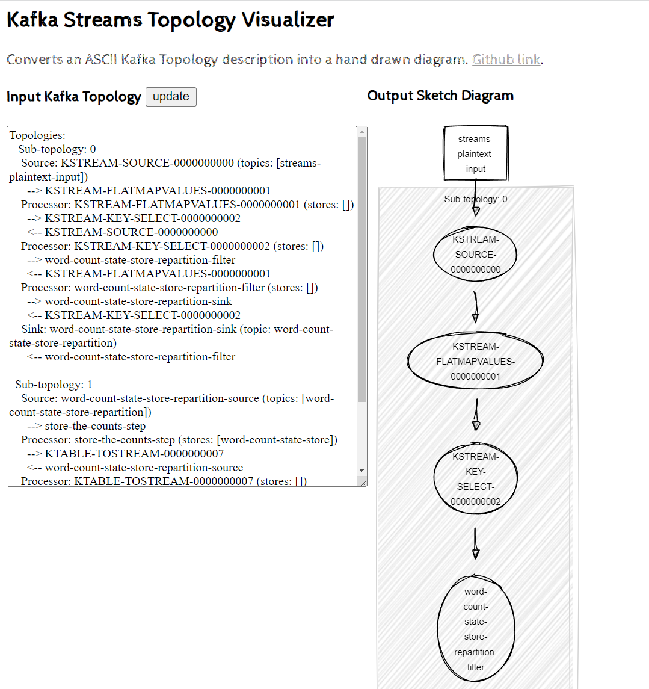

# Intro

Sample Kafka Streams DSL application
Useful to make first experiments, observe topology (printed to STDOUT at startup), inspect intermediate topics, states stores, rebalances
This project is a repackage of https://github.com/apache/kafka/blob/trunk/streams/examples/src/main/java/org/apache/kafka/streams/examples/wordcount/WordCountDemo.java in a gradle app, targeting a local Kafka platform created with docker-compose


# Requirements

<!> tested only on Linux, to be verified on Mac. Not working on WINDOWS

 * docker, docker-compose
 * JDK 11, gradle

TODO: remove deps from JDK and gradle, use only docker

# Start the Platform
 
 ```
 docker-compose up -d
 ```

# Create topics
  
 ```
docker-compose exec -it broker kafka-topics --bootstrap-server localhost:9092 --create --topic streams-plaintext-input  --partitions 4 --replication-factor 1 
```
 ```
docker-compose exec -it broker kafka-topics --bootstrap-server localhost:9092 --create --topic streams-wordcount-output --partitions 4 --replication-factor 1  || true
 ```
 ```
docker-compose exec -it broker kafka-topics --bootstrap-server localhost:9092  --list 
 ```


# Build application

```
gradle shadowJar
```

# Start application

```
java -jar build/libs/kstreams-wordcount-standalone-0.0.1.jar config.properties
```

TODO: make multiple application instances work by specifying different state.dir or relying on containers

# Observe topology with https://zz85.github.io/kafka-streams-viz/



# Prepare terminal windows to observe behavior

### Check KStream app final results emitted on a topic

```
docker-compose exec -it broker kafka-console-consumer --topic streams-wordcount-output --from-beginning \
                              --bootstrap-server localhost:9092 \
                              --property print.key=true \
                               --property value.deserializer=org.apache.kafka.common.serialization.LongDeserializer

```

### Check repartition topic

```
docker-compose exec -it broker kafka-console-consumer --bootstrap-server localhost:9092 --topic streams-wordcount-word-count-state-store-repartition --from-beginning  --property print.key=true

```

### Check changelog topic (topic which keeps the table state)

```
docker-compose exec -it broker kafka-console-consumer --bootstrap-server localhost:9092 --topic streams-wordcount-word-count-state-store-changelog --from-beginning --property print.key=true  --property value.deserializer=org.apache.kafka.common.serialization.LongDeserializer

```


# Input some text to input topic


```
docker-compose exec -it broker kafka-console-producer --broker-list localhost:9092 --topic streams-plaintext-input
```

Highly suggested to input following lines one by one and check what is emitted on terminal tabs previously opened on intermediate, changelog, output topics

```
hello kafka streams
all streams lead to kafka
join kafka summit 

```

# Reset tool
If you want to restart from scratch and delete the kafka stream application state and associated topics run the following command
```
./reset.sh
```